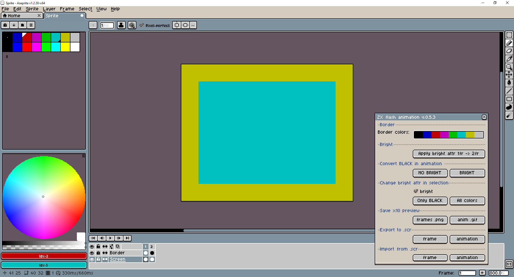

# ZX-flash-animation
The Aseprite tools to create and import/export ZX-Spectrum flash animation .scr (no pixels, only attributes)

The description in english will be later :)

Как установить скрипт:
1. Запускаем Aseprite
2. File - Scripts - Open Scripts Folder
3. Сохраняем файл ZX_flash_animation.lua в эту папку
4. Возвращаемся в Aseprite, File - Scripts - Rescan Scripts Folder

Как пользоваться:
1. Выбираем File - Scripts - ZX_flash_animation для того чтобы запустить скрипт
2. Появится попап с выбором ориентации экрана Horizontal или Vertical
3. Далее будет создан холст содержащий атрибутный экран спектрума и бордюр
4. Рисовать можно на "экране" размером 32х24 пикселя, палитра установлена ZX-Spectrum, менять цвет бордюра и прочее можно в инструментах "ZX flash animation"

